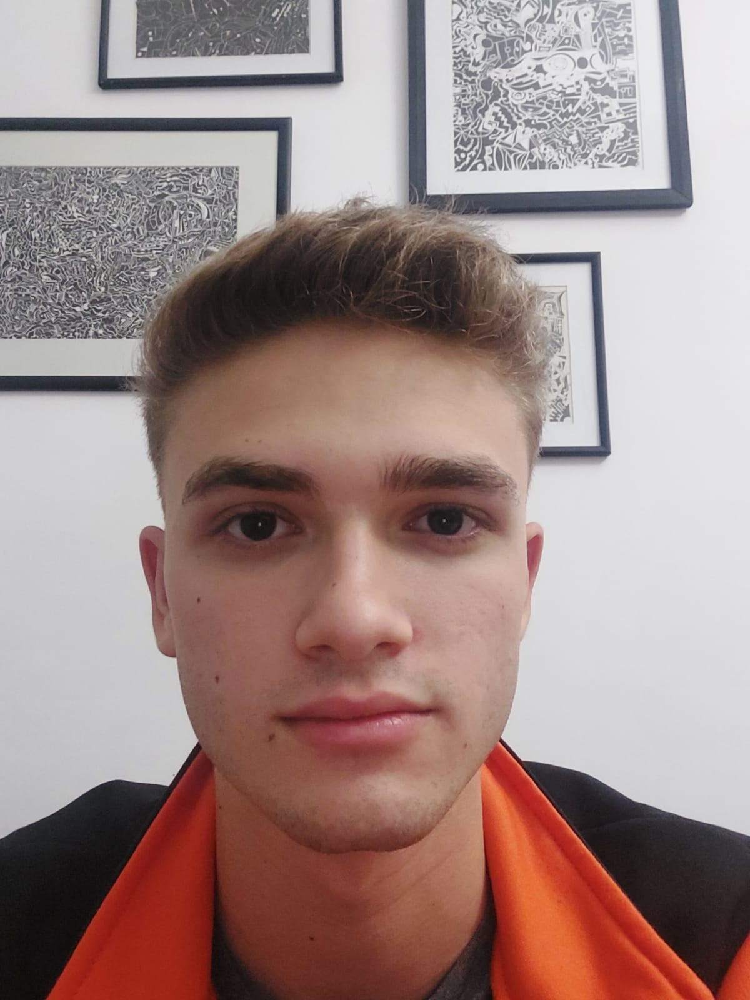

# Ramiro Casablancas

Hola mi Nombre es Ramiro y actualmente estoy cursando la Tenicatura en Programacion, este cuatrimestre estoy empezando el segundo año.
Arranque la carrera en 2022, pero en la tecnicatura de programacion de videojuegos, curse dos cuatris en esa tecnicatura y el cuatrimestre pasado decidí cambiarme a Programación.

En 2021 habia empezado la carrera de Ingenieria Electronica en la Universidad Tecnologica Nacional (UTN), y luego de cursar uin cuatrimestre decidi cambiarme a la UNAHUR.
Una vez finalizada la Tecnicatura en Programacion quiero seguir estudiando y terminar con la Licenciatura en Informatica, porque ademas de interesarme la programacion creo que me ayudaria en el mundo laboral.
Desde chico me intereso todo el tema de la tenología, y creo que tome la decision correcta al cambiarme de carrera, mi intencion es seguir aprendiendo cosas nuevas ademas de la programacion, como ciberseguridad o tal vez incluso robotica.

## Mis gustos

- Desde muy chico tengo pasion por los videojuegos,recuerdo jugar con mi primo y mi hermana a la play 2, me considero muy bueno en ellos y ademas soy muy competitivo, mi estilo de juego favorito son los fps.

- Ademas desde chico mis padres me inculcaron el hacer deporte por lo que siempre fui un chico inquieto y que disfruta casi cualquier deporte, mi favorito es el futbol y soy hincha de Independiente.

- Tambien me gusta la pesca, especialmente sobre mi kayak, desde chico siempre lo vi a mi padre disfrutar mucho de eso y ahora que soy mas grande puedo disfrutarlo tambien con él.

- Mis objetivos este año son: aprobar la mayor cantidad de materias posibles, conseguir un trabajo y ademas conseguir mi licencia de conducir (la cual la pude sacar recientemente)
